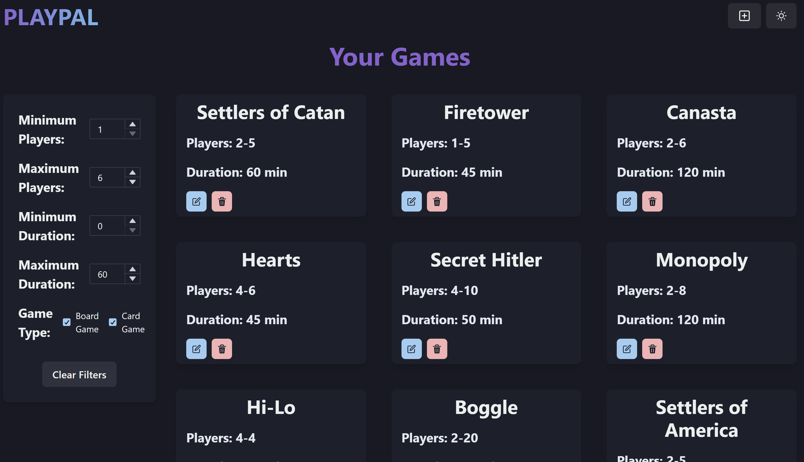
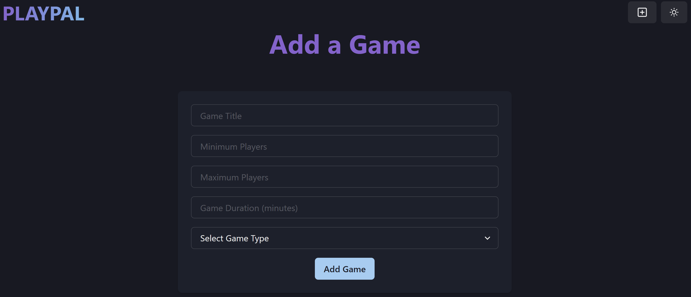

# PlayPal
### Author: Scott Puopolo
##### 10/23/2025

## Description:
Individual Full-Stack development project utilizing the MERN stack.

## Objective:
The object of the the application is to help users decide on a game to play. They may add games they own to a MongoDB database and view all of them from the home screen. Additionally, they can utilize the built-in filters in order to narrow down their choices to games that will best suit them in the moment. 

## Running the Application Locally:
1. After loading the project onto your local machine, navigate to the root of the project.
1. Create a new `.env` file.
    1. In the file, add the following variables: `MONGO_URI`, `PORT=5000`
    1. In order to set the `MONGO_URI` variable:
        1. Navigate to the [MongoDB Website](https://www.mongodb.com/) and log in.
        1. Create a new project (name it **playpal**).
        1. Create a cluster within **playpal**.
            1. Select the free version and name it Cluster0.
            1. After pressing *Create Deployment*, copy the password and save it somewhere.
            1. Then, click *Create User* and select **Drivers** with Node.js as the driver and hit *Close*.
            1. Get the *Connection String* and paste that as the value for the `MONGO_URI` variable.
        1. Lastly, navigate to the Network Access page and *Add IP Address*. Then click *Allow Access From Anywhere*.
1. Next, open a terminal at the root of the project.
1. From inside of the terminal run the following in order:
    1. `npm install` - This installs the packages needed for the whole project.
    1. `cd frontend` 
    1. `npm install` - This installs the packages needed for the frontend of the project.
    1. `cd ..`
    1. `npm run dev` - This begins the Express server on localhost port 5000.
1. Then, open a new terminal in the `frontend` folder of the project and run the `npm run dev` command from there. This starts the frontend UI on localhost port 5173.
1. Lastly, open a browser and go to http://localhost:5173 .

## Images:
### PlayPal Home Screen:

### PlayPal Add a Game Page: 
